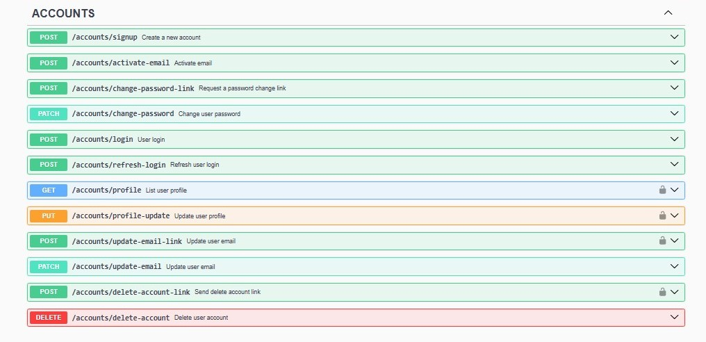

# Authentication Microservice with Express (TypeScript)

This repository contains an authentication microservice built with **Express** and **TypeScript**, designed to provide a robust and secure authentication solution using **JWT** (JSON Web Token) and **refresh tokens**.

## Technologies and Features

- **TypeScript**: Provides strong typing and enhanced developer experience.
- **Microservices**: A modular architecture that breaks down the application into smaller, independent services.
- **Node.js**: The runtime environment for building scalable and high-performance server-side applications.
- **Express**: Web framework for building the API endpoints.
- **Postgres**: Relational database management system for storing task data.
- **TypeORM**: ORM for interacting with the Postgres database in a type-safe manner.
- **Logs**: Centralized logging for monitoring and debugging.
- **Error Handler**: A robust error handling system to ensure reliability and proper user feedback.
- **Documentation (Swagger & Redocly)**: Automatically generated API documentation for ease of use and integration.
- **Rate Limiter (DDOS protection)**: Mitigates potential DDOS attacks by limiting the number of requests.
- **Inputs Validation (ZOD & Lodash)**: Ensures data integrity and prevents invalid inputs with ZOD and Lodash libraries.
- **Docker**: Containerization for consistent deployment and easy scalability.
- **Internationalization (Server-side Translation)**: Supports multiple languages to cater to a global user base.
- **JWT (JSON Web Tokens)**: A protocol for creating secure authentication tokens.
- **Refresh Token**: A method to extend a user's session without requiring them to re-enter credentials.
- **NodeMailer**: A service for sending email confirmations and other notifications.

### Documentation


## Installation

To run the Tasky Tracer API locally, follow these steps:

1. Clone the repository:

```bash
git clone https://github.com/juliokozarewicz/auth_express
```

2. Install dependencies:
```bash
cd auth_express
npm install
```

3. Creating Migrations:

To create a new migration after modifying your entities, run:
```bash
npm run typeorm migration:run -- -d server.ts #(linux)
npm run typeorm:win migration:run -- -d server.ts #(windows)
```

4. Set up environment variables for hosts, email, database and JWT configuration.